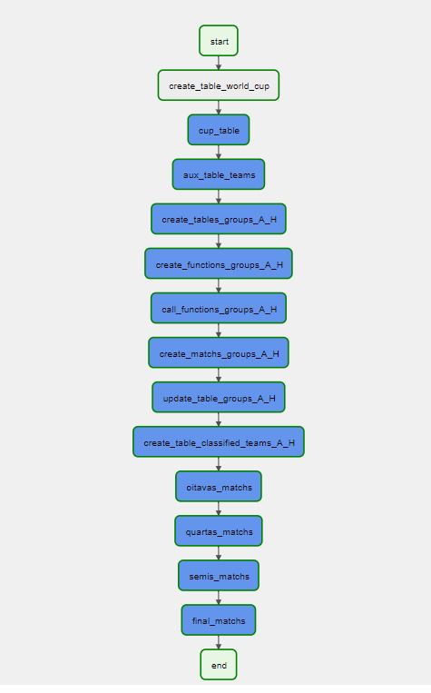
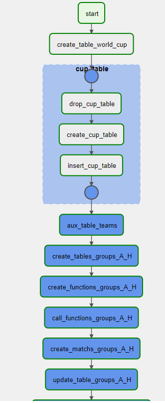
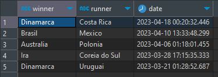
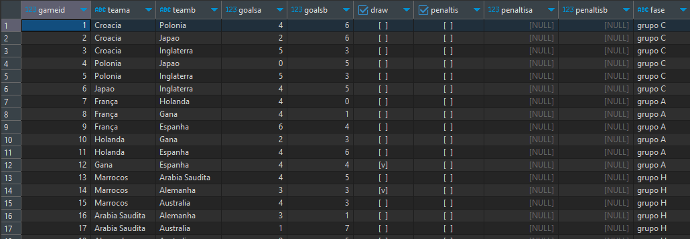

# Dags Airflow

## World Cup Dag

Uma dag que simula uma Copa do Mundo de Futebol.

A dag foi dividida em várias tarefas:
* Sorteio dos grupos
* Tabela de jogos da fase de grupos e seus respectivos resultados
* Classificação para o mata-mata até a grande final (Oitavas > Quartas > Semis > Final)
* Tabela de registro de todos os jogos
* Tabela final contendo o Campeão e o Vice
* Todos os grupos, jogos e resultados foram gerado aleatóriamente utilizando apenas o banco de dados ``Postgres``

Foi utilizado o ``PostgresOperator`` para a comunicação com o banco de dados

## Pontos de melhoria
* Melhorar a lógica para quando ocorrer um empate na fase mata-mata, incluindo os penaltis.
* Deixar os códigos sql em uma pasta separada e chamar somente o arquivo. (A dag contém 2k de linhas)
* Melhorar a ingestão das seleções para a Copa do Mundo. (Contém somente as 32 da copa de 2022)
* Melhorar 

## Prints

